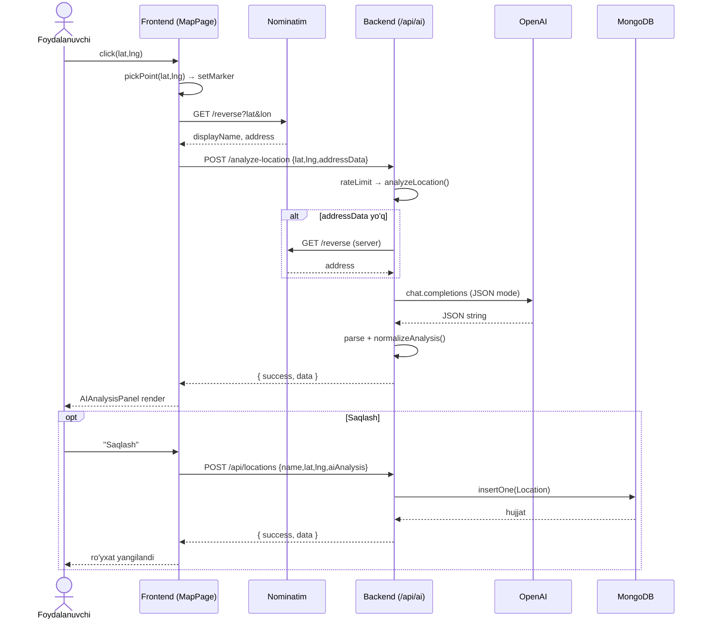

# miniGIS — Ma'lumotlar Oqimi Diagrammasi (Data Flow Diagram)

> **Loyiha:** miniGIS — AI-asoslangan interaktiv GIS platformasi
> **Turi:** BMI (Bitiruv malakaviy ishi)
> **Joylashuvi:** `web/`
> **Sana:** 2026-05-06
> **Versiya:** 1.0
> **Bog'liq hujjatlar:** [`README.md`](README.md), [`FUNC_ARCHITECTURE.md`](FUNC_ARCHITECTURE.md), [`BACKEND_ARCHITECTURE.md`](BACKEND_ARCHITECTURE.md), [`FRONTEND_ARCHITECTURE.md`](FRONTEND_ARCHITECTURE.md)

---

## 1. Maqsad va doiraviy izoh

Ushbu hujjat `miniGIS` tizimida **ma'lumot qanday paydo bo'ladi, qayerda qayta ishlanadi, qayerda saqlanadi va qayerga uzatiladi** — degan savolga DFD (Data Flow Diagram) klassik notatsiyasi bo'yicha javob beradi.

Diagramma **uch darajada** chizilgan:
- **DFD-0 (Context)** — tizim bitta qora quti sifatida; tashqi aktyorlar bilan chegaralari.
- **DFD-1 (Top-level)** — tizim ichidagi asosiy jarayonlar va ma'lumot saqlash joylari.
- **DFD-2 (Decomposition)** — har bir biznes-oqimning tafsiloti (UC-01…UC-05).

**Notatsiya kelishuvi:**

| Belgi | Ma'nosi |
|---|---|
| `[ Aktyor ]` | Tashqi entitet (foydalanuvchi yoki tashqi xizmat) |
| `( Jarayon )` | Tizim ichidagi mantiqiy jarayon (controller / service / hook) |
| `║ Saqlovchi ║` | Ma'lumot ombori (MongoDB collection, brauzer state, env) |
| `──►` | Ma'lumot oqimi yo'nalishi |
| `── label ──►` | Oqim ustidagi yorliq — uzatilayotgan ma'lumot turi |

---

## 2. DFD-0 — Konteks diagrammasi

```
                ┌──────────────────┐                ┌──────────────────────┐
                │   OpenAI         │                │  OSM Nominatim       │
                │   GPT-4o(mini)   │                │  (geocoding)         │
                └────────▲─────────┘                └──────────▲───────────┘
                         │ JSON tahlil                         │ display_name,
                         │ (chat completions)                  │ address{...}
                         │                                     │
                         │ system+user prompt                  │ q= / lat,lon
                         ▼                                     ▼
   ┌──────────────┐               ┌────────────────────────────────────┐               ┌──────────────────┐
   │              │  bosish       │                                    │   tile URL    │   Tile servers   │
   │  FOYDA-      │  (lat,lng)    │                                    │ ◄──────────── │  OSM / Esri /    │
   │  LANUVCHI    │ ────────────► │           miniGIS TIZIMI           │  raster PNG   │  OpenTopoMap /   │
   │  (brauzer)   │ ◄──────────── │   (frontend SPA + backend API)     │  ───────────► │  CARTO Dark      │
   │              │  AI panel,    │                                    │               └──────────────────┘
   │              │  marker,      │                                    │
   │              │  tarix        │                                    │
   └──────────────┘               └────────────────┬───────────────────┘
                                                   │
                                                   │  CRUD (joylar + AI natija)
                                                   ▼
                                          ┌────────────────────┐
                                          │  MongoDB (minigis) │
                                          │  locations coll.   │
                                          └────────────────────┘
```

**Tizim chegarasidagi entitetlar:**

| Entitet | Yo'nalish | Uzatilayotgan ma'lumot |
|---|---|---|
| Foydalanuvchi (brauzer) | I/O | `(lat,lng)` bosish, qidiruv matni ↔ AI panel, marker, tarix jadvali |
| OpenAI | O→I | system+user prompt, koordinata, manzil → JSON tahlil |
| Nominatim | O→I | `q=...` yoki `lat,lon` → `displayName`, `address{...}` |
| Tile providerlari | O→I | `z/x/y` tile so'rovi → raster rasm |
| MongoDB | I/O | `Location` hujjati (saqlash, o'qish, o'chirish) |

---

## 3. DFD-1 — Yuqori darajadagi jarayonlar

```
                              ┌──────────────────────────────────────────────────┐
                              │                  FOYDALANUVCHI                   │
                              └─────┬────────────────┬───────────────────┬───────┘
                                    │ click(lat,lng) │ search(q)         │ "Saqlash"
                                    ▼                ▼                   ▼
              ┌───────────────────────┐ ┌───────────────────────┐ ┌──────────────────┐
              │ P1. pickPoint()       │ │ P2. searchPlace()     │ │ P5. saveLocation │
              │ (MapPage hook)        │ │ (SearchBox+debounce)  │ │ (useLocations)   │
              └───────┬───────────────┘ └──────────┬────────────┘ └────────┬─────────┘
                      │                            │                       │
        marker, name  │ lat,lng                    │ q                     │ {name,lat,lng,aiAnalysis}
                      ▼                            ▼                       ▼
              ┌───────────────────────┐    ┌──────────────────┐   ┌───────────────────────┐
              │ P3. reverseGeocode    │    │ Nominatim search │   │ POST /api/locations   │
              │ (browser yoki server) │    │ (browser-side)   │   │ → locationController  │
              └───────┬───────────────┘    └──────────────────┘   └────────┬──────────────┘
                      │ displayName                                        │ Mongoose validate
                      ▼                                                    ▼
              ┌───────────────────────┐                            ║ MongoDB.locations ║
              │ P4. analyzeLocation() │ ◄─── lat,lng,addressData
              │  (POST /api/ai/...)   │
              └───────┬───────────────┘
        prompt + addr │            ▲ JSON
                      ▼            │
              ┌──────────────┐     │
              │ OpenAI Chat  │ ────┘
              │ (JSON mode)  │
              └──────────────┘

                                    ┌───────────────────────┐
                                    │ P6. listLocations()   │ ◄── GET /api/locations ◄── /history sahifasi
                                    │ P7. deleteLocation()  │ ◄── DELETE /api/locations/:id
                                    └──────────┬────────────┘
                                               ▼
                                       ║ MongoDB.locations ║
```

**Asosiy jarayonlar ro'yxati:**

| ID | Jarayon | Joylashuvi | Kirish | Chiqish |
|---|---|---|---|---|
| **P1** | `pickPoint(lat,lng)` | `frontend/pages/MapPage` | xarita click | marker + AI ishga tushirish |
| **P2** | `searchPlace(q)` | `frontend/components/SearchBox` + `useDebounce` | qidiruv matni | tanlash → `flyTo` |
| **P3** | `reverseGeocode(lat,lng)` | `frontend/services/geocoding` *yoki* `backend/services/geocodingService` | koordinata | `displayName`, `address{...}` |
| **P4** | `analyzeLocation()` | `backend/ai/locationAnalyzer` | `(lat,lng, addressData?)` | normallashgan AI tahlili |
| **P5** | `saveLocation(payload)` | `backend/controllers/locationController` | `{name,lat,lng,aiAnalysis?}` | yangi `Location` hujjati |
| **P6** | `listLocations()` | `backend/controllers/locationController` | filter (yo'q) | `Location[]` (sort `createdAt:-1`, lim 500) |
| **P7** | `deleteLocation(id)` | `backend/controllers/locationController` | `:id` | `{ success: true }` |

---

## 4. DFD-2 — Asosiy biznes-oqimlari (Decomposition)

### 4.1 Oqim A — Click → Reverse geocode → AI tahlili (UC-01)

```
┌────────────┐    click(e.latlng)    ┌─────────────────┐
│ Foydala-   │ ────────────────────► │ MapView.jsx     │
│ nuvchi     │                       │ (react-leaflet) │
└────────────┘                       └────────┬────────┘
                                              │ pickPoint(lat,lng)
                                              ▼
                                     ┌──────────────────┐
                                     │ MapPage state    │  setMarker(...)
                                     │ + useState       │  setName(loading)
                                     └────────┬─────────┘
                                              │
                ┌─────────────────────────────┴─────────────────────────────┐
                │                                                           │
                ▼                                                           ▼
   ┌──────────────────────────┐                              ┌────────────────────────────┐
   │ services/geocoding.js    │ ── GET /reverse?lat&lon ───► │  Nominatim                 │
   │ reverseGeocode(lat,lng)  │ ◄── displayName, address ─── │  (browser-side, UI uchun)  │
   └──────────────┬───────────┘                              └────────────────────────────┘
                  │ name → MapPage.state
                  ▼
   ┌──────────────────────────┐                              ┌────────────────────────────┐
   │ services/aiService.js    │ ── POST /api/ai/analyze ───► │ aiController + rateLimit   │
   │ analyzeLocation(lat,lng) │                              │ → ai/locationAnalyzer.js   │
   └──────────────┬───────────┘                              └──────────────┬─────────────┘
                  ▲                                                         │
                  │  { success:true, data:{ classification,                  │ addressData yo'q?
                  │    country, region, terrain, confidence,                 │ → reverseGeocode (server)
                  │    suggestedUsage[], geocoding{...} } }                  ▼
                  │                                            ┌──────────────────────────┐
                  │                                            │ buildUserPrompt(...)     │
                  │                                            │ (prompts.js)             │
                  │                                            └──────────────┬───────────┘
                  │                                                           ▼
                  │                                            ┌──────────────────────────┐
                  │                                            │ chatJSON()               │
                  │                                            │ (openaiService, JSON     │
                  │                                            │  mode, temp 0.2)         │
                  │                                            └──────────────┬───────────┘
                  │                                                           │
                  │                                            ┌──────────────▼───────────┐
                  │                                            │ JSON.parse + ```json     │
                  │                                            │ fence tozalash           │
                  │                                            └──────────────┬───────────┘
                  │                                                           ▼
                  │                                            ┌──────────────────────────┐
                  │                                            │ normalizeAnalysis()      │
                  │                                            │ (trim, clamp, array fix) │
                  │                                            └──────────────┬───────────┘
                  │                                                           │
                  └────────────────────────── { success, data } ◄─────────────┘
                                              │
                                              ▼
                                ┌─────────────────────────────┐
                                │ AIAnalysisPanel.jsx         │
                                │ (sidebar render + skeleton) │
                                └─────────────────────────────┘
```

**Race-safety eslatmasi:** `aiService` ichida `requestId` counter — agar foydalanuvchi tezda ikkinchi marta xaritaga bossa, eski natija yangisini bosib o'tmaydi (UI ID'siga qarab `setState` qiladi).

### 4.2 Oqim B — Joyni MongoDB'ga saqlash (UC-02)

```
┌────────────┐  "Saqlash"   ┌──────────────────────┐  payload   ┌──────────────────────────┐
│ Foydala-   │ ───────────► │ AIAnalysisPanel.jsx  │ ─────────► │ useLocations.add(...)    │
│ nuvchi     │              └──────────────────────┘            │ (frontend hook)          │
└────────────┘                                                  └────────────┬─────────────┘
                                                                             │ axios POST
                                                                             ▼
                                                              ┌──────────────────────────────┐
                                                              │ POST /api/locations          │
                                                              │ → locationController.create  │
                                                              └────────────┬─────────────────┘
                                                                           │ validateCoordinates
                                                                           ▼
                                                              ┌──────────────────────────────┐
                                                              │ Mongoose Schema validate     │
                                                              │ (required, min/max, length)  │
                                                              └────────────┬─────────────────┘
                                                                           │ insertOne
                                                                           ▼
                                                                  ║ MongoDB.locations ║
                                                                           │
                                                              ┌────────────▼─────────────────┐
                                                              │ { success:true, data:{...} } │
                                                              └────────────┬─────────────────┘
                                                                           ▼
                                                              UI: ro'yxatni yangilash + toast
```

**Saqlanadigan hujjat (Mongoose `Location` sxemasi):**

```js
{
  _id:        ObjectId,
  name:       String,        // displayName yoki foydalanuvchi tahriri
  latitude:   Number,        // [-90, 90]
  longitude:  Number,        // [-180, 180]
  note:       String?,
  aiAnalysis: {              // ixtiyoriy snapshot
    classification, country, region, district, placeName,
    description, suggestedUsage[], terrain, confidence
  }?,
  createdAt:  Date,          // timestamps: true
  updatedAt:  Date
}
```

### 4.3 Oqim C — Tarixni ko'rish va boshqarish (UC-03)

```
[Foydalanuvchi] ── /history ──► HistoryPage ──► useLocations.load()
                                                    │ axios GET
                                                    ▼
                                        ┌──────────────────────────┐
                                        │ GET /api/locations       │
                                        │ → controller.list()      │
                                        └────────────┬─────────────┘
                                                     │ find().sort({createdAt:-1}).limit(500)
                                                     ▼
                                              ║ MongoDB.locations ║
                                                     │
                                        ┌────────────▼─────────────┐
                                        │ Location[]                │
                                        └────────────┬──────────────┘
                                                     ▼
                          ┌──────────────────────────────────────────────┐
                          │ HistoryPage:                                  │
                          │  • useMemo filter (qidiruv matni bo'yicha)    │
                          │  • Jadval render                              │
                          │  • "Xaritada ko'rish" → /map?lat=..&lng=..    │
                          │  • "O'chirish" → DELETE /api/locations/:id    │
                          └──────────────────────────────────────────────┘
                                                     │ delete
                                                     ▼
                                        ┌──────────────────────────┐
                                        │ controller.remove()      │
                                        │ → findByIdAndDelete()    │
                                        └────────────┬─────────────┘
                                                     ▼
                                              ║ MongoDB.locations ║
```

### 4.4 Oqim D — Qidiruv orqali joy topish (UC-04)

```
[Foydalanuvchi] ── matn ──► SearchBox.jsx ──► useDebounce(450ms)
                                                    │ q
                                                    ▼
                                  ┌──────────────────────────────┐
                                  │ Nominatim /search?q=&format= │ ── HTTP GET ─►  Nominatim
                                  │  &accept-language=uz,en,ru   │ ◄── [{name,
                                  └────────────┬─────────────────┘     lat, lon, ...}]
                                               ▼
                                  ┌──────────────────────────────┐
                                  │ dropdown render              │
                                  └────────────┬─────────────────┘
                                               │ tanlash
                                               ▼
                                       map.flyTo(lat,lng)
                                               │
                                               └─► Oqim A ga ulanadi (P1 → P3 → P4)
```

> Bu oqim **brauzer-side**. Nominatim Usage Policy talabi: `User-Agent` mos, ≤1 req/sec, debounce majburiy.

### 4.5 Oqim E — AI xatosi va qayta urinish (UC-05)

```
OpenAI ──► (429 / 401 / network) ──► aiController catch
                                          │
                                          ▼
                              ┌─────────────────────────┐
                              │ res.status(code).json({ │
                              │   success:false,        │
                              │   message: human-text   │
                              │ })                      │
                              └────────────┬────────────┘
                                           ▼
                              ┌─────────────────────────┐
                              │ aiService → throw       │
                              │ AIAnalysisPanel.error   │
                              └────────────┬────────────┘
                                           │ "Qayta urinish"
                                           ▼
                                runAIAnalysis(lat,lng)  ──► Oqim A.P4
```

---

## 5. Ma'lumot saqlash joylari (Data stores)

| ID | Saqlovchi | Qatlami | Hayot davri | Misol mazmuni |
|---|---|---|---|---|
| **DS-1** | `MongoDB.minigis.locations` | Backend (persist) | Doimiy | Saqlangan joylar + AI snapshot |
| **DS-2** | `MapPage` React state | Frontend (memory) | Sahifa hayoti | `marker`, `name`, `aiAnalysis`, `loading` |
| **DS-3** | `useLocations` cache | Frontend (memory) | Sahifa hayoti | tarix ro'yxati + filter natijasi |
| **DS-4** | `localStorage('theme')` | Brauzer | Doimiy | `'light' \| 'dark'` |
| **DS-5** | `process.env` | Backend (boot) | Server hayoti | `OPENAI_API_KEY`, `MONGO_URI`, `AI_RATE_LIMIT_PER_MIN`, … |
| **DS-6** | `express-rate-limit` xotirasi | Backend (memory) | Slayding oyna (1 daq) | IP→count, AI endpointi uchun |

> **Eslatma:** DS-6 **process xotirasida** — server qayta ishga tushganda nolga qaytadi. Production uchun `redis` store tavsiya etiladi (kelajakda).

---

## 6. Tashqi tizimlar bilan ma'lumot shartnomalari

### 6.1 OpenAI Chat Completions

```
REQUEST  (backend → OpenAI)
─────────────────────────────────────────────────────
  model:           OPENAI_MODEL  (default gpt-4o-mini)
  temperature:     0.2
  response_format: { type: 'json_object' }
  messages:        [
    { role: 'system', content: SYSTEM_PROMPT },
    { role: 'user',   content: buildUserPrompt({lat,lng,addressData}) }
  ]

RESPONSE (OpenAI → backend)
─────────────────────────────────────────────────────
  choices[0].message.content  →  JSON string:
  {
    classification, country, region, district, placeName,
    description, suggestedUsage[], terrain, confidence
  }
```

### 6.2 Nominatim

```
SEARCH   (browser → Nominatim)
  GET https://nominatim.openstreetmap.org/search
       ?q=<text>&format=json&accept-language=uz,en,ru
  Headers: User-Agent: miniGIS-BMI/1.0 (academic project)

REVERSE  (browser yoki backend → Nominatim)
  GET https://nominatim.openstreetmap.org/reverse
       ?lat=&lon=&format=json&accept-language=uz,en,ru
  →  { display_name, address{ country, state, city, ... } }
```

### 6.3 Ichki API shartnomasi

Barcha backend javoblari yagona formatda:

```json
{ "success": true,  "data":    { /* … */ } }
{ "success": false, "message": "human readable" }
```

---

## 7. Ma'lumotlarni qayta ishlash bosqichlari (transformatsiyalar)

```
RAW input (foydalanuvchi)              VALIDATED                NORMALIZED
─────────────────────────              ──────────                ──────────
{ lat: "41.31", lng: "69.27" }   ─►   typeof number       ─►    Number(lat), Number(lng)
                                       lat ∈ [-90,90]
                                       lng ∈ [-180,180]

OpenAI raw JSON (string)         ─►   JSON.parse + fence  ─►    object
                                       removal

object                           ─►   normalizeAnalysis() ─►    {
                                       • string trim                classification: trimmed,
                                       • suggestedUsage:            country/region: trimmed,
                                         to array, max 6            suggestedUsage: string[],
                                       • confidence:                confidence: 0..1,
                                         clamp to [0,1]             terrain: trimmed
                                                                  }
```

**Validatsiya zanjiri (kirish ma'lumoti uchun):**

```
1. Frontend (UX)        →  raqamli input, format
2. Controller           →  validateCoordinates(), typeof
3. Mongoose Schema      →  required, min/max, maxlength
4. MongoDB driver       →  oxirgi himoya
```

---

## 8. Sequence diagrammasi (Mermaid) — UC-01

> Markdown render qiluvchilar (GitHub, VS Code) Mermaid'ni avtomatik chizadi.



---

## 9. Xavfsizlik va shovqin nuqtalari (data flow bo'yicha)

| Nuqta | Xavf | Choralar |
|---|---|---|
| `OPENAI_API_KEY` | Brauzerga sizib chiqishi | Faqat backend `.env`da, hech qachon frontendga uzatilmaydi |
| `/api/ai/*` | Tarif suiiste'moli (DDoS / cost) | `express-rate-limit` per IP, default 20/min |
| Nominatim | Usage Policy buzilishi → 403 | `User-Agent` header, qidiruvda `useDebounce(450ms)` |
| Foydalanuvchi inputi | Buzuq koordinata, juda uzun matn | 4 darajali validatsiya (UX → controller → schema → driver) |
| OpenAI hallucination | Noto'g'ri JSON yoki matn | JSON mode + `normalizeAnalysis()` + "noma'lum" qoidasi promptda |
| Race condition | Ketma-ket clicklar | `requestId` counter — eski natija yangisini almashtira olmaydi |
| Mongo `note`/`name` | Juda uzun matn | Schema `maxlength` |

---

## 10. Qisqacha umumlashtirish

- **Ma'lumot 5 ta yo'nalishda harakat qiladi:**
  1. Foydalanuvchi → Frontend (klick, qidiruv, saqlash);
  2. Frontend → Nominatim (qidiruv va UI uchun reverse geocode);
  3. Frontend → Backend (REST API);
  4. Backend → OpenAI / Nominatim (server-side AI promptini boyitish);
  5. Backend → MongoDB (CRUD + AI snapshot).

- **Yagona javob shartnomasi** (`{success, data|message}`) butun stack bo'ylab saqlanadi.
- **Persistlangan yagona ma'lumot** — `locations` collection; qolgan barcha holat (state, cache, rate-limit) **xotirada**.
- **Tashqi xizmatlar bilan munosabat** ikki yo'nalishli: brauzer-side (qidiruv) va server-side (AI uchun reverse geocode + OpenAI), shu sababli reverse geocoding **ikki nuqtada** mavjud.
- **AI oqimi** alohida himoyalangan: rate-limit, JSON mode, normalize layeri, race-safe ID counter.

---

> Hujjat boshqa diagrammalar bilan birga foydalaniladi:
> • UC-blok diagrammalari — `FUNC_ARCHITECTURE.md` §7
> • Component bog'liqlik diagrammasi — `FUNC_ARCHITECTURE.md` §10
> • Backend qatlam diagrammasi — `BACKEND_ARCHITECTURE.md` §3, §10
> • Frontend orchestration — `FRONTEND_ARCHITECTURE.md` §6
